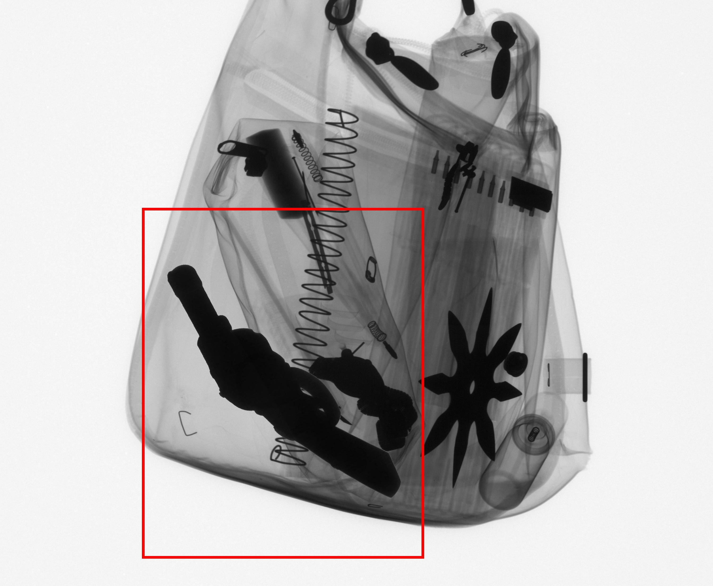
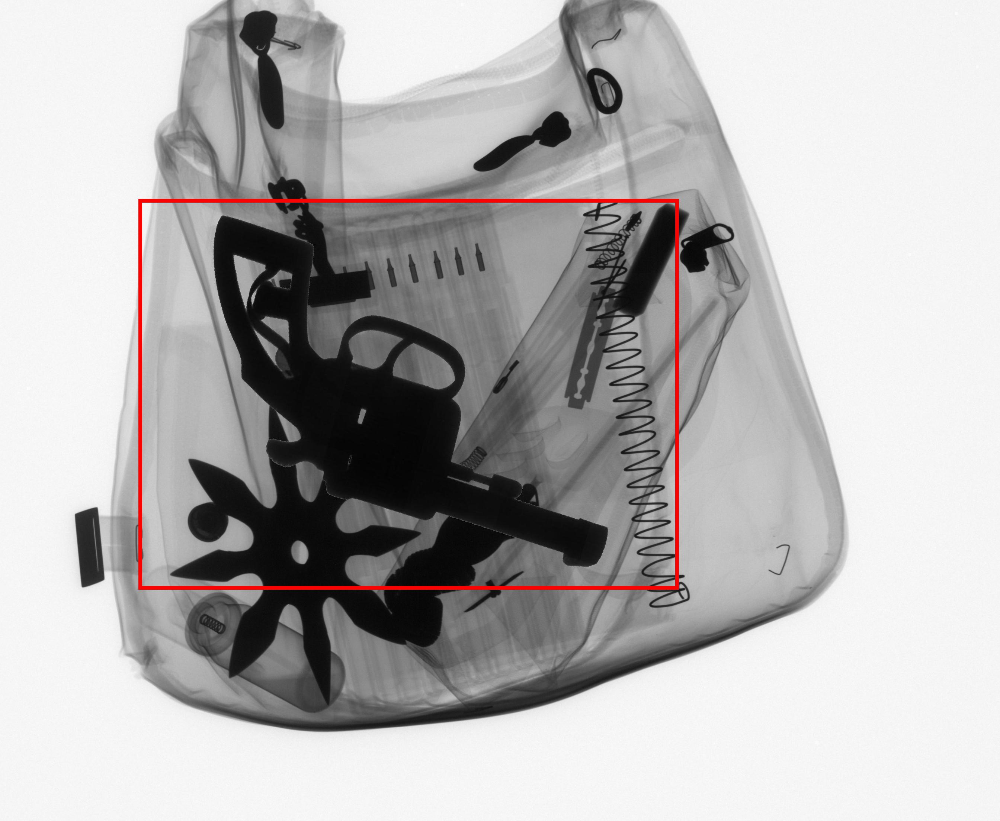
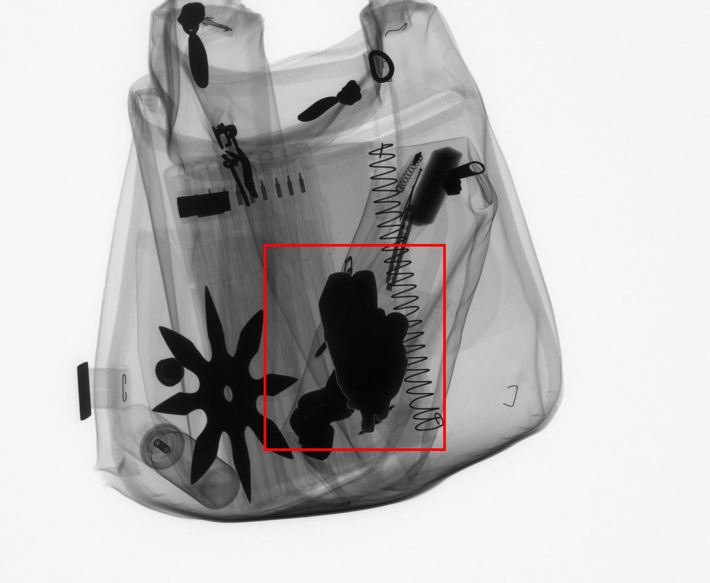
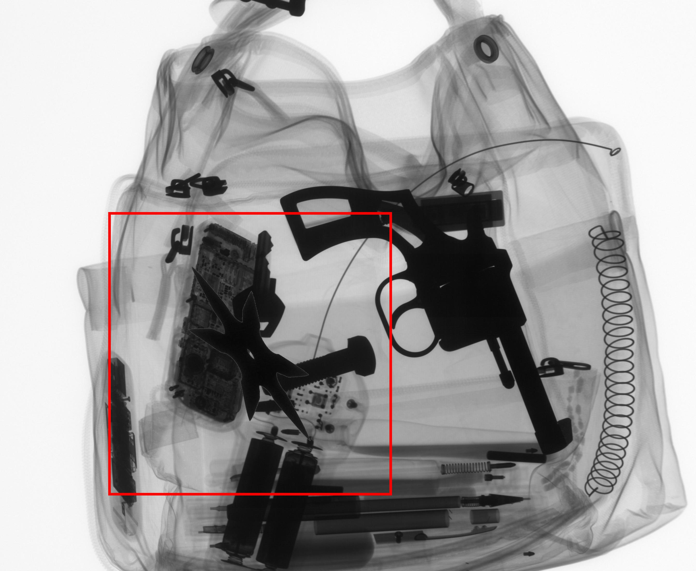
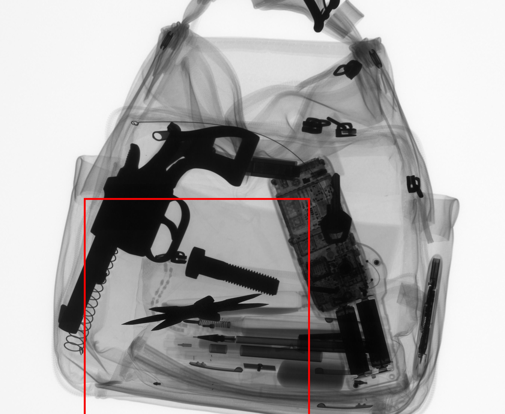
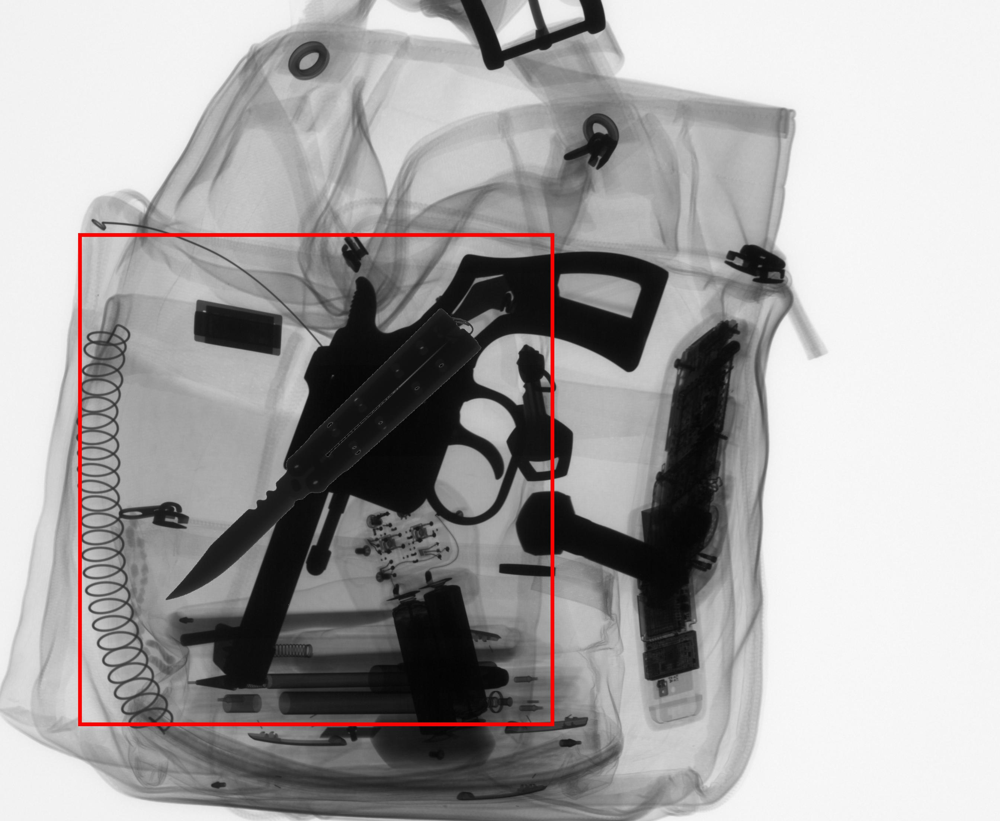
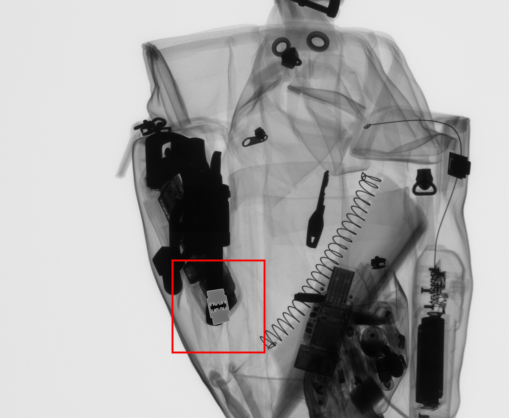
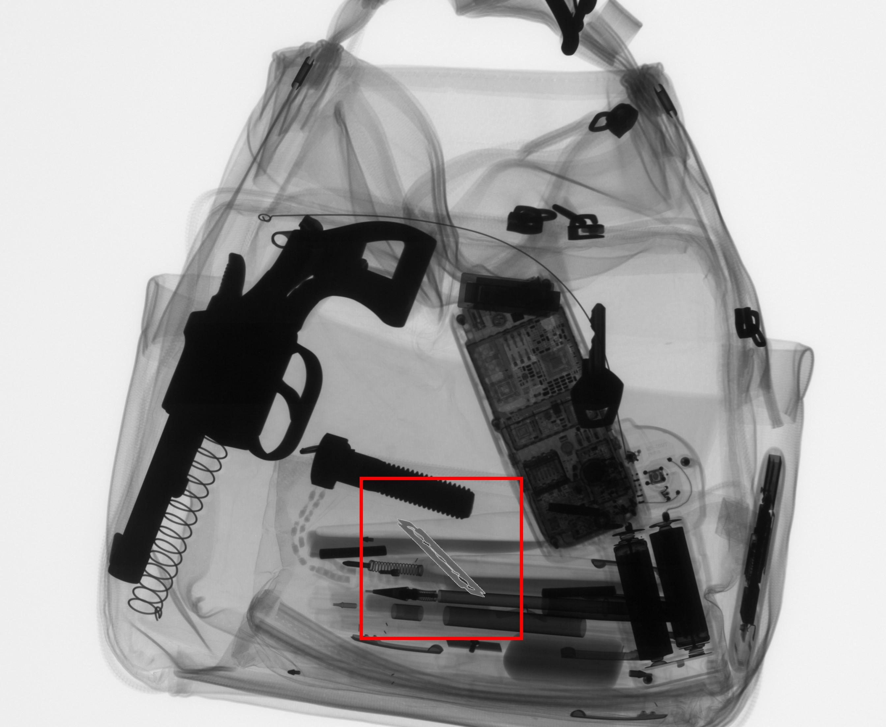

# Threat Image Projection

## TOOLS USED
    * Language
        python3
    * Libraries
        opencv
        numpy
        matplotlib
        pillow
        skimage

## Paper Implemented

[The Good, the Bad and the Ugly: Evaluating Convolutional Neural Networks for Prohibited Item Detection Using Real and Synthetically Composited X-ray Imagery](https://arxiv.org/abs/1909.11508)


## Usage Instructions
1. Install the required Libraries
    ```sh
    python3 -m pip install -r requirements.txt
    ```
2. Start Jupyternoetbook and run `Synthetic Image Generation` and `Synthetic Image Generation-GUN`

## Algorithm
We have implemented the research paper above to create new images.

[TIP Algorithm from paper](https://i.imgur.com/Pn9QLV2.png)
    
1. Threat Signature Transformation
     * Remove image from background with simple thresholding
     * Rotate by random angle theta
     
     

2. Image position determination
    * Find the biggest region in baggage where we can insert the 
    threats using the following steps sequentially

        1. Binarize image by thresholding
        2. Dilation
        3. Hole Filling 
        4. Erosion

        
        

         

3. Image compositing
    * Since we know the size of threat image and each pixel of our morpohlogicalized image  has pixel value 255 in the region of interest .We can simply check if the end position of the threat image has value 255. This does result in small mistakes sometimes, but it is computationally much faster then checking each pixel

    * For insertion we randomly choose a point in the region of insertion and see if the threat image fits and keep repeating the process untill we find a valid region

    


## Random Samples

GUNS






SHURIKEN



KNIFE



Blade




## Results & Conclusion
*  we were able to generate the large amount of data with minimal resource(average of 2 seconds to generate 1 image) and automated labelling.
* But due to lack of diversity and threats. (We have very limited number of baggages we can use,Some are either to small or too dark to be used for TIP), There is a chance that a model will overgeneralize to fit only these types of images.

## References
https://www.sciencedirect.com/science/article/abs/pii/S0375960121001705
https://www.witpress.com/elibrary/wit-transactions-on-the-built-environment/82/15153
https://github.com/computervision-xray-testing/pyxvis
https://opencv.org/