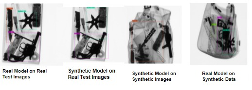

# Yolov3-tiny for Windows and Linux

## (neural networks for object detection)

## TOOLS USED
    * Language
        python3
        C++
        
    * Libraries
        opencv
        numpy
        matplotlib
        pillow
        skimage
        cuda
        cudnn


## How to compile on Linux (using make) : make -j 4; make

Just run make, to build the darknet binary. Validate the path of Libraries in Makefile.

Important Flags In Makefile :

**OPENCV=0/1** : Add or remove the support of opencv

**GPU=0/1**   : Enable or Disable GPU Support

**CUDNN=0/1** : Enable or Disable CUDNN Support

**CUDNN_HALF=0/1** : Enable or Disable CUDNN_HALF Support

Recommended To Use All Flags Values as: 1 , for faster model training and testing.


## Using Pre-Trained Models For Training :
1) TEST/weights/yolov3-tiny_synthetic.weights: Model Trained on Synthetic Image Dataset
2) TEST/weights/yolov3-tiny_real.weights     : Model Trained on Real Image Dataset
   
Note: Both the model training involves transfer learning by using the pre-trained weights of imagenet dataset 

(TEST/weights/yolov3-tiny.weights)

## Files Path :
**TEST/cfg/yolov3-tiny.data**    : Contains the Paths of TestDataset, TrainDataset, labels path and weight stored path

**TEST/cfg/yolov3-tiny_test.cfg** : Contains network architecture used for Training. We have configured this architecture 
                                for detection of 4 classes.Adjust the value of batch , say batch = 64 means we will be 
                                using 64 images for every training step. Another Parameter is subdivisions, say subdivisons=2, 
                                the batch will be divided by 8 to decrease GPU VRAM requirements. 
                                
**Params: cfg/yolov3-tiny.data**

classes : No of Classes For Which Model is to be trained 

train [ train.txt ]  : Training File Path 

valid [ test.txt ]   : Testing File Path 

names   : Labels Names

backup  : Path where training weights are stored

Use the create_train_text.py python script to generate train.txt, training file and test.txt, testing file
on sample image dataset. After Generation of these files update the path in above cfg/yolov3-tiny.data file.


**Two Types Of Dataset Used :**

**a) Real Image Dataset**     : GDXRay Image Dataset

Download : http://dmery.sitios.ing.uc.cl/images/GDXray/Baggages.zip

Explore Dataset : https://www.dropbox.com/sh/m5hrxcnme8kve6a/AABeAHFJVOzV650jujgeaOqRa?dl=0

**b) Synthetic Image Dataset** : [Generated From Threat Image Projection](../TIP)


**Training & Testing Files**

TEST/Data/test.txt : Contains the Real Images Testing FilePath 

TEST/Data/test_synthetic.txt : Contains Synthetic Images Testing FilePath 

TEST/Data/train_real.txt : Contains the Real Images Training FilePath

TEST/Data/train_synthetic.txt : Conatins the Synthetic Images Training FilePath


## Annotated Text Files For Custom Images To Train

For Each Bounding Box in image we need to define below annotations in folder which contains images for training & validation. 
Sample Annotation For Single Bounding Box on image is defined below, we can have multiple classes of objects in one image and thus, 
have multiple labels in single image annotation file. For Simplicity we are using image_name.txt for saving annotations.  

Sample Annotation Of Single Object :

3 0.288690 0.670516 0.343006 0.410779

Label_ID_1 X_CENTER_NORM Y_CENTER_NORM WIDTH_NORM HEIGHT_NORM

X_CENTER_NORM = BOUNDING_BOX_X_CENTER/IMAGE_WIDTH

Y_CENTER_NORM = BOUNDING_BOX_Y_CENTER/IMAGE_HEIGHT

WIDTH_NORM = WIDTH_OF_BOUNDING_BOX/IMAGE_WIDTH

HEIGHT_NORM = HEIGHT_OF_BOUNDING_BOX/IMAGE_HEIGHT
                                
Using labelImg tool to draw bounding boxes and prepare data for training and testing. 

## Classes Detected By Model : 4 Classes
0 -> Gun

1 -> Knife

2 -> Razor

3 -> Shuriken


## Training : On Train Path Configured in yolov3-tiny.data

./darknet detector train ./TEST/cfg/yolov3-tiny.data ./TEST/cfg/yolov3-tiny.cfg  ./TEST/weights/yolov3-tiny.weights -dont_show 

-dont_show {Optional} : Disable GUI Display Component of Code 

## Testing : Evaluation on Testing Dataset

./darknet detector map ./TEST/cfg/yolov3-tiny.data  ./TEST/cfg/yolov3-tiny.cfg  ./TEST/weights/yolov3-tiny.weights -dont_show

-dont_show {Optional} : Disable GUI Display Component of Code 

## Testing : Validation of Testing Dataset 

./darknet detector valid ./TEST/cfg/yolov3-tiny.data ./TEST/cfg/yolov3-tiny.cfg  ./TEST/weights/yolov3-tiny_real.weights -dont_show 


## Testing : Testing Output on single image

./darknet detector test ./TEST/cfg/yolov3-tiny.data ./TEST/cfg/yolov3-tiny.cfg ./TEST/weights/yolov3-tiny_real.weights ./TEST/Data/realData/B0046_0037.png -dont_show

Repeat the steps above with Change in training & testing file to evaluate the results.


### Outputs :




**Note:** Screenshots of Accuracy Comparision between Real & Synthetic Data are stored in Report Folder.

## References :
https://www.mdpi.com/1424-8220/20/22/6450/htm

https://breckon.org/toby/publications/papers/akcay17region.pdf

https://www.researchgate.net/publication/340034588_An_improved_method_of_Tiny_YOLOV3

http://pjreddie.com/darknet/
```
